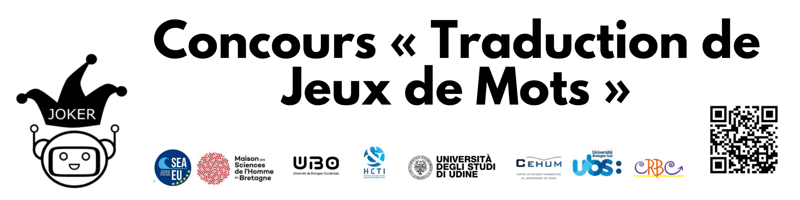

# JOKER

  

[All pun translation contests](./index) | [JOKER project](https://www.joker-project.com/)
 

## Prix
### Lauréat
* Jean-Charles MEUNIER

### Catégorie " Meilleure traduction "
* Romane RULLIER
* Jean-Charles MEUNIER
* Michel DELARCHE

### Catégorie " Prix spécial "
* Noémie VANDENBORRE et Charlotte DANIEL
* Emma OLIVIER

[Liste des participant.e.s](./Concours JDM - liste des participants.pdf)

## Concours

L'objectif de ce concours est de traduire le maximum de jeux de mots dans la liste fournie **vers le français**. 

Date limite : **24 février 2022** 23h59 (heure de Paris GMT+1)

Les participants seront classés en fonction du **nombre de traductions jugées valides**. La traduction d’un jeu de mots est considérée comme une traduction valide si :
- elle préserve le champ sémantique du texte d’origine
- elle contient une forme de jeu de mots 

Par exemple, la personne qui envoie 50 traductions jugées valides sera classée avant la personne qui n'en a envoyé que 20. Cependant le jury pourra également décerner un **prix aux meilleures traductions**, quel que soit le nombre de traductions envoyées. 

Les participants **peuvent choisir** les jeux de mots à traduire dans la liste fournie. Il n'y a pas d'ordre à respecter. Les traductions **peuvent être modifiées après leur envoi jusqu’à la date limite** en suivant le lien  reçu dans le mail de confirmation d'envoi.

La participation au concours implique la cession aux organisateurs des droits d'auteur sur les traductions produites et l'acceptation du [règlement](Réglement-concours-joker.pdf).

## Formulaire du concours

[https://forms.gle/Sp1NTG4YMVk29HMd9](https://forms.gle/Sp1NTG4YMVk29HMd9)

## Organisateurs

* Liana Ermakova (UBO)
* Benoît Jeanjean (UBO)
* Gaëlle Le Corre (UBO)
* Élise Mathurin (UBO)
* Caroline Comacle (UBO)
* Mohamed Saki (UBO)
* Jean-Yves Le Disez (UBO)
* Helen McCombie (BTU)
* Sébastien de Villèle (BTU)
* Catherine Davis (BTU)
* Radia Hannachi (UBS)
* Sílvia Araújo (University of Minho, Portugal)
* Fabio Regattin (Università degli Studi di Udine, Italy)
* Claudine Borg (University of Malta)

## Contacts
[contact@joker-project.com](mailto:contact@joker-project.com)
